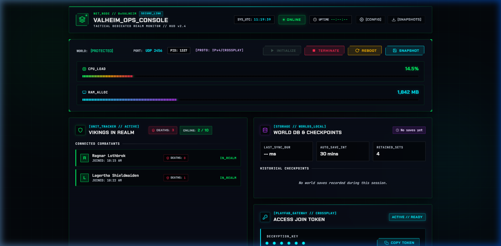

# Valheim Dedicated Server Dashboard & Automation Suite

[](https://github.com/NeonCipherDhu/valheim-server-dashboard)
[](https://nodejs.org/)
[](https://steamdb.info/app/896660/)
[](https://github.com/NeonCipherDhu/valheim-server-dashboard)
[](LICENSE)

An all-in-one, real-time web dashboard and automated management suite for hosting, monitoring, and operating a **Valheim Dedicated Server** on Windows. Engineered with a **Tactical Operations Cyber-HUD** interface, this suite provides live CPU core and RAM telemetry, automated PlayFab crossplay join code extraction, engine-level player death tracking, world save diagnostics, manual backup snapshots, and seamless process lifecycle control.

---



---

## Table of Contents
- [Key Features](#key-features)
- [Feature Comparison Matrix](#feature-comparison-matrix)
- [Quick Start Guide](#quick-start-guide)
  - [1. Prerequisites](#1-prerequisites)
  - [2. Launch the Web Dashboard & Auto-Setup](#2-launch-the-web-dashboard--auto-setup)
  - [3. Configure Server Parameters via Web UI](#3-configure-server-parameters-via-web-ui)
  - [4. Start Server & Connect](#4-start-server--connect)
- [Using Custom & Existing Worlds](#using-custom--existing-worlds)
  - [Generating a New Realm with Custom or Random Seed](#generating-a-new-realm-with-custom-or-random-seed)
  - [Importing an Existing World (Single-Player or Previous Server)](#importing-an-existing-world-single-player-or-previous-server)
- [Connecting to Your Server](#connecting-to-your-server)
  - [Method A: PlayFab Join Code (Crossplay - Recommended)](#method-a-playfab-join-code-crossplay---recommended)
  - [Method B: Direct IP & Port Forwarding](#method-b-direct-ip--port-forwarding)
- [Architecture & Tech Stack](#architecture--tech-stack)
- [Frequently Asked Questions (FAQ)](#frequently-asked-questions-faq)
- [Security & Privacy](#security--privacy)

---

## Key Features

### Dedicated Server Process & Lifecycle Control
- **1-Click Web Management**: Start, gracefully terminate, and reboot `valheim_server.exe` directly from any local browser.
- **Dynamic Process Attachment**: Automatically discovers and attaches to existing running server instances by PID upon launch.
- **Corruption-Free Shutdown**: Transmits graceful termination signals to ensure world database buffers flush to disk properly before the process exits.

### Real-Time Resource Telemetry & Health Monitoring
- **Multi-Core Normalized CPU Load**: Accurately measures processor time deltas across all logical CPU cores (0–100%), matching Windows Task Manager without artificial single-core scaling artifacts.
- **Resident Set RAM Tracking**: Monitors dedicated server memory allocation in megabytes (MB) continuously.
- **WebSocket Streaming**: Instant, bidirectional metrics stream over WebSockets with zero manual browser refreshing.
- **Active Uptime Clock**: Tracks continuous session duration and system UTC synchronization.

### Player Tracking & Engine Death Hook
- **Active Viking Roster**: Real-time list of connected players displaying character name, Steam ID, and join timestamp.
- **Mod-Free Casualty Counter**: Intercepts the Valheim server engine's character unbind signatures (`Got character ZDOID from <Player> : 0:0`) to maintain an accurate death tally per player in real time.
- **Clan Statistics Archive**: Automatically persists historical player records and cumulative statistics across server reboots.

### PlayFab Crossplay Gateway (Routerless Connection)
- **Automatic Join Code Extractor**: Intercepts the dynamic 6-digit PlayFab crossplay join code from the server boot stream upon cloud registration.
- **1-Click Copy**: Instantly copy the join code to share with friends playing on **Steam**, **Xbox One**, **Xbox Series X|S**, or **PC Game Pass** without configuring router port forwarding!
- **Link State Indicator**: Displays network link status, port allocation, and community server visibility.

### World Database & Backup Management
- **Local World Detection**: Reads `.fwl` and `.db` files from local directories and Windows AppData.
- **1-Click Snapshot Backups**: Creates timestamped zip archives of active world data before patching or testing.
- **Storage Diagnostics**: Displays world file byte sizes and last modified timestamps.

### Windows Automation Scripts
- **`setup_server.ps1`**: Automated SteamCMD download, anonymous authentication, and dedicated server installer/updater.
- **`start_server.ps1`**: Standalone PowerShell wrapper for launching `valheim_server.exe` with custom parameters.
- **`open_firewall_ports.bat`**: Automatically opens Windows Firewall inbound rules for UDP ports `2456-2457`.
- **`start_dashboard.bat`**: Single-click desktop launcher for the Node.js dashboard backend.

---

## Feature Comparison Matrix

| Capability | Standard Valheim `.bat` Script | Tactical Automation Suite |
| :--- | :--- | :--- |
| **User Interface** | Plain text CMD terminal | Cyber-Viking responsive Web HUD |
| **PlayFab Join Code** | Buried in verbose boot logs | Auto-extracted with 1-click copy |
| **CPU / RAM Telemetry** | None | Live multi-core normalized telemetry |
| **Player Death Tracking** | None (Raw engine lines only) | Live casualty counter per viking |
| **Remote Browser Access** | No | Accessible via localhost or LAN |
| **World Backup Snapshots** | Manual file browsing | 1-click on-demand manual snapshots |
| **SteamCMD Auto-Setup** | Manual download & install | Automated `setup_server.ps1` script |

---

## Quick Start Guide

### 1. Prerequisites
- **Windows OS**: Windows 10, Windows 11, or Windows Server (64-bit).
- **PowerShell**: PowerShell 5.1 (standard Windows built-in) or PowerShell 7+.
- **Node.js**: Version 16.0.0 or newer ([Download Node.js LTS](https://nodejs.org/)).

### 2. Launch the Web Dashboard & Auto-Setup

Simply double-click **`start_dashboard.bat`**!

- **Smart Self-Bootstrapping Engine**: Automatically verifies your environment on initial launch. If **SteamCMD** or the official **Valheim Dedicated Server** app (AppID `896660`) is not yet installed, it automatically downloads and installs them for you. Once all dependencies are satisfied, future launches skip installation in milliseconds and start the dashboard immediately.
- **Zero-Window Silent Mode**: The dashboard runs silently in the background with zero command prompt or PowerShell window clutter.
- **Auto-Browser Open**: Automatically launches your default web browser directly to `http://localhost:8085`.
- **Developer / Console Debug Mode**: If you ever want to see raw live Node.js logs in a visible terminal window, run:
  ```powershell
  .\start_dashboard.bat /console
  ```
- **Stopping the Dashboard**:
  - **In-Browser**: Click the red **`[EXIT]`** button in the top-right header of the web dashboard.
  - **Desktop**: Double-click **`stop_dashboard.bat`**.

*(Optional: You can also run `.\setup_server.ps1` in PowerShell at any time if you prefer to manually install or update the server files independently).*

### 3. Configure Server Parameters via Web UI

> **All configurations are directly available in the Web UI!**  
> There is no need to manually copy or edit config files. The web dashboard provides an interactive configuration center with live validation and automatic persistence.

1. Open the dashboard at `http://localhost:8085` and click the **`[SETTINGS]`** button in the top navigation bar (or click **`[CONFIG]`** next to any detected realm).
2. Configure all your server and realm parameters directly from the interface:
   - **Server Name**: Custom title displayed in the server browser or Discord status (e.g. `AMABOYS_DServer`).
   - **Realm Password**: Access password (minimum 5 characters). Click the **`GEN`** key button to automatically generate a secure alphanumeric password.
   - **Active Realm / World**: Select any detected realm, generate a new procedural world with custom seeds and gameplay presets, or import an existing world.
   - **Crossplay (PlayFab)**: Toggle Crossplay on to generate automatic 6-digit join codes for Steam, Xbox One, Xbox Series X|S, and PC Game Pass cross-platform play.
   - **Community Server**: Toggle whether your realm is publicly discoverable in the global Valheim community list.
   - **World Preset & Modifiers**: Choose gameplay presets (*Default*, *Casual*, *Easy*, *Hard*, *Hardcore*, *Immersive*, or *Hammer* free-build mode) or set custom world modifiers.
   - **Network Ports**: Game UDP port (default `2456`) and Web Dashboard port (default `8085`).
   - **Auto-Save & Snapshots**: Set the auto-save frequency in seconds (default `1800`s / 30 min) and snapshot retention count.
3. Click **SAVE CONFIGURATION** (or **INITIALIZE WORLD MATRIX** when creating a new realm). All changes are automatically synchronized and persisted to disk.

*(Optional / Headless: If hosting in a headless or automated CI environment without a browser, `server_config.example.json` can still be copied to `server_config.json` and edited manually).*

### 4. Start Server & Connect

1. Click the green **`[START SERVER]`** button in the Web Dashboard header.
2. Watch real-time multi-core CPU, RAM, and uptime telemetry stream live into your Cyber-HUD.
3. Once the server registers with PlayFab, click the **Join Code** in the dashboard header to copy your 6-digit key and share it with your vikings!

---

## Using Custom & Existing Worlds

The tool is completely flexible and lets you either generate fresh procedural worlds or import your existing worlds from single-player or other dedicated servers.

### Generating a New Realm with Custom or Random Seed

You don't need to manually edit config files or guess seeds! The dashboard includes an integrated **Realm Manager & Seed Generator**:

1. In the Web Dashboard, click the **`[SETTINGS]`** button in the navigation bar (or **`NEW REALM`** inside the World DB card).
2. Enter your desired **Realm Name** (e.g. `OdinValhalla`).
3. Set your **World Seed**:
   - **Custom Seed**: Type any custom seed string you like (e.g. `MyEpicSeed77`). The dashboard calculates and displays the exact Valheim engine stable hash in real time!
   - **Roll Random Seed**: Click the **ROLL SEED** button to randomly generate Norse-themed seeds (e.g., `Valhalla99_412`, `FenrirFrost_519`) or high-entropy alphanumeric seeds.
4. *(Optional)* Select a **World Preset** (Default, Casual, Easy, Hard, Hardcore, Immersive, or Hammer free-build mode).
5. Click **INITIALIZE WORLD MATRIX**. The dashboard writes the native binary world metadata into `worlds_local/`, sets it as the active world, and prepares the server to generate the map upon start!

### Importing an Existing World (Single-Player or Previous Server)
If you already have a world with built bases, tamed boars, and exploration progress that you want to host on this server:

1. **Locate Your Existing World Files**:
   - Press <kbd>Win</kbd> + <kbd>R</kbd>, paste the following path, and press **Enter**:
     ```
     %USERPROFILE%\AppData\LocalLow\IronGate\Valheim\worlds_local
     ```
   - *(Note: If your world was saved to Steam Cloud, it may be in `%USERPROFILE%\AppData\LocalLow\IronGate\Valheim\worlds` instead)*
   - Locate the files matching your world's name:
     - `<WorldName>.db` (or a folder named `<WorldName>` containing the database chunks)
     - `<WorldName>.fwl`

2. **Copy Them to This Server's `worlds_local/` Folder**:
   - Copy your `<WorldName>.db` and `<WorldName>.fwl` into the **`worlds_local/`** folder of this repository:
     ```
     valheim-server-dashboard/
     └── worlds_local/
         ├── <WorldName>.db
         └── <WorldName>.fwl
     ```

3. **Activate Your World in the Web Dashboard**:
   - In the Web Dashboard, open **`[SETTINGS]`** &rarr; **Detected Worlds**, where your imported realm will automatically appear. Click **`ACTIVATE`** (or **`[CONFIG]`** to adjust passwords, ports, and presets).
   - *(Alternatively, you can set `"worldName": "<WorldName>"` in `server_config.json`).*

4. **Launch the Server**:
   - Click **Start Server** in the Web Dashboard (or run `start_server.bat`). The server will immediately load your existing world with all structures, items, and map exploration completely intact!

---

## Connecting to Your Server

### Method A: PlayFab Join Code (Crossplay - Recommended)
1. Copy the 6-digit **Join Code** displayed on the dashboard header.
2. In Valheim: **Start Game** → Select Character → **Join Game** tab.
3. Click the **Join Code** button, paste the code, and enter your password.
> Works seamlessly across Steam, PC Game Pass, and Xbox consoles without configuring router port forwarding!

### Method B: Direct IP & Port Forwarding
- **Local LAN**: Connect using `192.168.x.x:2456`.
- **Public Internet**: Forward UDP ports `2456–2457` on your router to your host PC. Run `open_firewall_ports.bat` to configure Windows Defender Firewall. Connect via `[Your-Public-IP]:2456`.

---

## Architecture & Tech Stack

```
valheim-server-dashboard/
├── dashboard/               # Lightweight Node.js dashboard service
│   ├── server.js            # Express & WebSocket telemetry daemon, process monitor
│   └── public/              # Cyber-Viking HUD frontend (HTML5, Vanilla CSS, JS)
├── docs/                    # Documentation preview assets
│   └── valheim-tactical-hud.png # UI preview asset
├── worlds_local/            # Local dedicated server world saves & snapshots
├── setup_server.ps1         # SteamCMD installer & Valheim server binary updater
├── start_server.ps1         # Standalone PowerShell launcher with parameter verification
├── start_dashboard.bat      # 1-click dashboard startup batch file
├── open_firewall_ports.bat  # Windows Defender Firewall UDP rule configuration
└── server_config.json       # Local server configuration (git-ignored)
```

- **Frontend**: Vanilla HTML5, CSS custom properties, Chakra Petch & JetBrains Mono typography, WebSocket event listeners, Lucide SVG iconography.
- **Backend**: Node.js, Express, `ws` (WebSockets), Windows Management Instrumentation (WMI/process time sampling).
- **Automation**: PowerShell 5.1/7.x, SteamCMD (Valve AppID `896660`).

---

## Frequently Asked Questions (FAQ)

<details>
<summary><b>Can I bring my existing single-player world or a world from another server?</b></summary>
<br>
<b>Yes, absolutely!</b> Valheim world saves are 100% portable. Copy your <code>&lt;WorldName&gt;.db</code> and <code>&lt;WorldName&gt;.fwl</code> files from your personal saves folder (<code>%USERPROFILE%\AppData\LocalLow\IronGate\Valheim\worlds_local</code>) into this project's <code>worlds_local/</code> folder (or use the <b>IMPORT REALM</b> drag-and-drop tool in the Web Dashboard), then activate it in the Web Dashboard Settings menu. All buildings, chests, and world progress will load seamlessly.
</details>

<details>
<summary><b>Can friends join without port forwarding?</b></summary>
<br>
<b>Yes.</b> When Crossplay is enabled in the Web Dashboard Settings (or <code>"crossplay": true</code> in <code>server_config.json</code>), the Valheim server establishes a tunnel via Microsoft PlayFab. The dashboard captures the 6-digit join code, which players on Steam, Xbox, and PC Game Pass can use to connect directly without router adjustments.
</details>

<details>
<summary><b>Does this require installing mods on clients or servers?</b></summary>
<br>
<b>No mods required.</b> The suite is 100% vanilla-compatible. Death tracking, player roster extraction, and save latency monitoring are achieved by parsing the server's native stdout stream and process hooks.
</details>

<details>
<summary><b>How do I update Valheim when an official game patch is released?</b></summary>
<br>
<b>Stop the server from the dashboard, then run <code>./setup_server.ps1</code>. SteamCMD will validate existing files and download newly updated binaries automatically while preserving your worlds and settings.</b>
</details>

<details>
<summary><b>How much system overhead does the dashboard add?</b></summary>
<br>
<b>Negligible overhead.</b> The Node.js monitoring daemon utilizes non-blocking event-driven I/O, using less than 1% CPU and approximately 40 MB of RAM.
</details>

---

## Security & Privacy
- **Localhost Binding**: The management API is bound to `127.0.0.1` by default to prevent unauthorized network access.
- **Strict Data Isolation**: Personal world files (`worlds_local/`, `*.db`, `*.fwl`), runtime logs, and sensitive credentials (`server_config.json`) are excluded via `.gitignore`.

## License
This project is open-source software released under the [MIT License](LICENSE).  
*Valheim is a registered trademark of Iron Gate AB and Coffee Stain Publishing. This community automation suite is an independent tool not affiliated with or endorsed by Iron Gate AB.*
